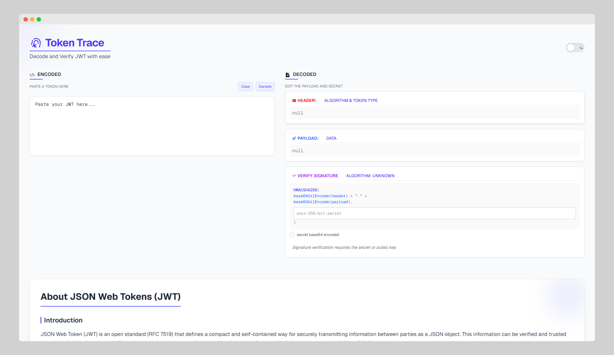

# TokenTrace

TokenTrace is a modern web application for decoding, analyzing, and verifying JSON Web Tokens (JWTs), designed to help developers debug authentication workflows easily and efficiently.



## Features

- **Token Decoder**: Instantly decode and visualize JWT components (header, payload, signature)
- **Signature Verification**: Verify JWT signatures using secret keys or public keys
- **Base64 Support**: Handle base64-encoded secrets and public keys
- **Algorithm Detection**: Automatically detect and display the algorithm used for token signing
- **Dark/Light Mode**: Toggle between dark and light themes for comfortable viewing
- **Responsive Design**: Optimized for both desktop and mobile viewing
- **Real-time Feedback**: Immediate validation errors and feedback
- **Sample Tokens**: Quick access to sample tokens for testing

## Technology Stack

- **Next.js**: React framework with server-side rendering capabilities
- **TypeScript**: For type safety and improved developer experience
- **Web Crypto API**: For secure token verification
- **TailwindCSS**: For responsive and clean UI design
- **Framer Motion**: For subtle UI animations (if implemented)

## Getting Started

### Prerequisites

- Node.js (version 18.0 or higher recommended)
- npm or yarn

### Installation

1. Clone the repository
   ```bash
   git clone https://github.com/yourusername/TokenTrace.git
   cd TokenTrace
   ```

2. Install dependencies
   ```bash
   npm install
   # or
   yarn install
   ```

3. Run the development server
   ```bash
   npm run dev
   # or
   yarn dev
   ```

4. Open [http://localhost:3000](http://localhost:3000) in your browser

## Building for Production

```bash
npm run build
npm run start
# or
yarn build
yarn start
```

## Usage

1. Paste your JWT into the input field
2. View the decoded header and payload
3. Enter your secret key or public key to verify the signature
4. Toggle the base64 checkbox if your key is base64 encoded

## Security Considerations

- All JWT processing happens client-side; no tokens are sent to any server
- No data is stored or logged
- Uses the Web Crypto API for secure cryptographic operations

## License

This project is licensed under the MIT License - see the [LICENSE](LICENSE) file for details.

## Contributing

Contributions are welcome! Please feel free to submit a Pull Request.

1. Fork the repository
2. Create your feature branch (`git checkout -b feature/amazing-feature`)
3. Commit your changes (`git commit -m 'Add some amazing feature'`)
4. Push to the branch (`git push origin feature/amazing-feature`)
5. Open a Pull Request

## Acknowledgments

- Inspired by the need for a clean, modern JWT debugging tool
- Built with modern web technologies for the best developer experience
